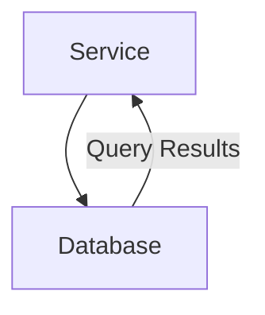
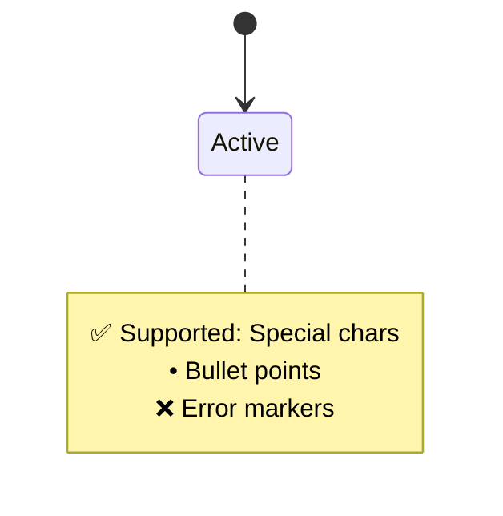
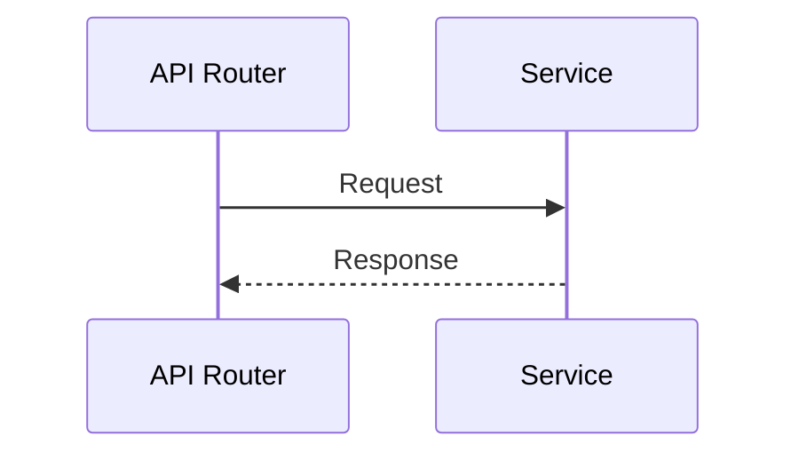

# Mermaid Syntax Rules

## Valid Code Structure

### Graph Diagrams (Flowcharts)

### State Diagrams

### Sequence Diagrams

## Constraints

| Supported | Forbidden |
|-----------|-----------|
| **Diagram Type Declaration** (must start with graph/flowchart/etc) | Missing diagram type |
| **Special Characters** (✅, ❌, •) in notes | Malformed syntax blocks |
| **Complex Labels** ("Service Name") | ` ` tags (use `\n` or newlines in notes) |
| **RGB Colors** (`rect rgb(...)`) | |
| **Participant Aliases** (`participant A as Alias`) | |

