# EMDCA: Explicitly Modeled Data-Centric Architecture

[](ref/arch.md)
[](LICENSE)
[](https://www.python.org/downloads/)
[](https://github.com/astral-sh/ruff)

**A rigorous architectural standard for building correct-by-construction, AI-native software systems.**

EMDCA eliminates "conceptual fragmentation" by enforcing strict co-location of **Logic, Data, and Capability** within the Domain Model.

---

## 🎯 The Core Philosophy: The Thing IS The Thing


That's the thesis. Right there. If you only take one thing from this it should be:

**"The thing should be the thing."**

A huge swath of the IT industry exists to manage the gap between:
- The code and the documentation about the code
- The schema and the validator that checks the schema
- The type and the mapper that translates the type
- The contract and the implementation that fulfills the contract
- The rule and the test that verifies the rule

We have whole careers built around keeping these pairs synchronized. Documentation writers. Integration testers. API governance teams. Schema registries. Contract testing frameworks.

All of it exists because we made two things when there should be one.

EMDCA collapses the pairs:

- The type IS the validation
- The schema IS the documentation
- The model IS the API contract
- The transition IS the business rule
- The field description IS the specification

When they're the same artifact, drift is impossible. The thing cannot lie about itself.

That's not our reality though. The majority of industry has always treated synchronization problems as inevitable. We built tooling, process, and entire job functions around managing them, but that was a mistake. The answer is: *stop making two things*.

It's simple. It's so obvious it sounds naive. But it is also profound. Sadly, too much of our received wisdom made it invisible. "Separation of concerns" became "separation of artifacts" and nobody questioned whether those were the same thing.

They're not.

Your program is three directories and an entry point.

```
src/
├── main.py              # Composition root: load config, wire, run
├── api/                 # HTTP translation layer
│   ├── app.py           # FastAPI instance
│   └── {context}.py     # Routes per context
├── domain/              # The system
│   ├── {context}/       # Vertical slice per business concept
│   │   ├── entity.py    # Active models (data + logic + capabilities)
│   │   ├── store.py     # Active storage capability
│   │   ├── workflow.py  # State machine + runtime
│   │   ├── api.py       # Foreign model: our HTTP contract
│   │   ├── vendor.py    # Foreign model: external APIs
│   │   └── db.py        # Foreign model: database schema
│   ├── shared/          # Cross-context primitives
│   └── system/          # Config (BaseSettings)
└── service/             # Wiring only
    └── {context}.py     # Instantiate clients, inject into models
```

That's it.

**`domain/`** is 90% of your code. It's where the system lives.

**`service/`** is almost nothing. Create client. Pass to model. Done.

**`api/`** is translation. Foreign model in, domain call, result out.

**`main.py`** is ten lines. Load config. Wire services. Run app.

No `utils/`. No `helpers/`. No `common/`. No `lib/`. No `core/`. No `managers/`. No `handlers/`. No `processors/`.

If you can't place a file in one of these four places, the file shouldn't exist.

Software often separates the "Definition" of an entity (Model) from the "Action" of that entity (Service). This creates a "Passive Domain" that cannot protect itself or act on the world.

**EMDCA inverts this.**
The Domain Model is **Active**. It owns its data, its rules, and its ability to act. The Service Layer exists only to **provision** the Domain with the tools (Capabilities) it needs.

### What This IS:
*   **Active Models:** `EventStore` holds `NatsClient` and calls `publish()`. `Order` holds `PricingPolicy` and calls `calculate()`.
*   **Injection:** Capabilities (Tools) are passed into Models at construction.
*   **Co-location:** If a concept "Stores Events," the logic for storing events lives on the concept's Model.

### What This IS NOT:
*   **Anemic Models:** Passive DTOs that are manipulated by "Manager" classes.
*   **Magic Globals:** Hidden dependencies pulled from the air. Dependencies are explicit arguments.
*   **Abstract Interfaces:** We do not mock `IEventBus`. We inject the real `EventCapability` (Model).

---

## ⚖️ The 10 Mandates

1.  **Construction:** **Correctness by Construction.** Invalid input causes a Crash (`ValidationError`), not a logic branch.
2.  **State:** **Behavioral Types (Smart Enums).** The Enum defines the lifecycle graph; the Model holds the state.
3.  **Control Flow:** **Railway Logic.** Structural failures (Input) Crash; Business failures (Logic) return Results.
4.  **Execution:** **Active Capability.** The Domain Model holds the capability to execute its intent.
5.  **Configuration:** **Schema as Domain.** `AppConfig(BaseSettings)` is the Domain's definition of the environment.
6.  **Storage:** **Store as Model.** An `EventStore` is a Domain Model that encapsulates the DB Client and Logic.
7.  **Translation:** **Explicit Boundary.** Foreign Models parse raw data; Domain Models own the translation logic.
8.  **Coordination:** **Runtime as Model.** The Orchestrator is a Domain Model that drives the state machine loop.
9.  **Workflow:** **State Machine.** Transitions are pure functions on the Model; Side Effects are capabilities invoked by the Model.
10. **Infrastructure:** **Capability Injection.** Infrastructure is passed to the Domain as a Tool (Client), not hidden behind an Interface.

**→ Read the [Architecture Spec](ref/arch.md) for the detailed laws.**

---

## 🧱 Building Blocks

*   **Smart Enums:** The "Brain." Defines the rules of the state graph.
*   **Domain Models:** The "Body." Holds Data + Logic + Capabilities.
*   **Capabilities:** The "Hands." Injected tools (Clients) that allow the Model to affect the world.
*   **Service Layer:** The "Factory Floor." Wires Capabilities into Models and starts the process.

```mermaid
flowchart TD
    %% 1. Use flowchart TD for smoother curves
    
    subgraph COMP [main.py - Composition Root]
        Config[[AppConfig]]
        NC[(NatsClient)]
        PG[(PostgresClient)]
        Config --> NC
        Config --> PG
    end

    subgraph SVC [service - Wiring]
        Wire{{Construct & Inject}}
    end

    subgraph DOM [domain - Active Models]
        ES[(EventStore)]
        OS[(OrderStore)]
        RT([OrderRuntime])
        OM[Order.ship]
        NS[ShippedOrder]
        
        RT -->|loads via| OS
        RT -->|publishes via| ES
        RT -- calls --> OM
        OM -.->|returns| NS
    end

    subgraph API [api - Translation]
        HTTP(POST /orders/ship)
        RES(Response)
    end

    %% Wiring Flows
    NC -.-> Wire
    PG -.-> Wire
    Wire ==>|Inject| ES
    Wire ==>|Inject| OS
    Wire ==>|Inject| RT
    
    %% Execution Flows
    HTTP ==>|to_domain| RT
    RT ==>|Result| RES
```



---

## 🔧 Cursor Agent Architecture

The `.cursor/` directory implements active enforcement for AI agents working in this codebase.

*   **Rules:** `pattern-*/RULE.md` define the laws.
*   **Mirror:** `hooks/mirror.py` runs AST analysis to detect structural violations (Identity: Service/Domain class types; Flow: try/except/raise/await in Domain; Naming: validate_ functions).
*   **Feedback:** The system writes violations to `mirror-feedback.md` automatically.

**→ Read [Cursor Agent Architecture](ref/cursor_arch.md) for details on the enforcement system.**

---

## 📚 Documentation

| Document | What It Is |
| :--- | :--- |
| **[Manifesto](manifesto.md)** | The **Philosophy**. Why explicit modeling matters. |
| **[Architecture Spec](ref/arch.md)** | The **Laws**. The 10 mandates in detail. |
| **[Patterns Library](ref/patterns/)** | The **Blueprints**. Idiomatic Python implementations. |
| **[Structure Guide](ref/structure.md)** | The **Map**. Vertical slice file organization. |
| **[Reference Skeleton](ref/src/)** | The **Template**. A working starter structure. |

---

## 🚀 Getting Started

1.  **Define the Capability:** What tool does the domain need? (e.g. `NatsClient`).
2.  **Define the Model:** Create a Pydantic Model that holds the Data and the Capability.
3.  **Define the Logic:** Write methods on the Model that use the Capability.
4.  **Wire the Service:** In `main.py`, create the Client and inject it into the Model.

**For AI Agents:** This repo is designed for you. The `.cursor/rules/` prime your context. The constraints act as guardrails. Hallucinations become compilation errors.

---

## License

This project is licensed under the MIT License - see the [LICENSE](LICENSE) file for details.
