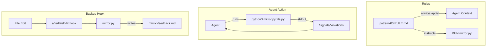

# EMDCA: Explicitly Modeled Data-Centric Architecture

[](ref/arch.md)
[](LICENSE)
[](https://www.python.org/downloads/)
[](https://github.com/astral-sh/ruff)

**A rigorous architectural standard for building correct-by-construction, AI-native software systems.**

EMDCA eliminates "conceptual fragmentation" by enforcing strict co-location of logic and data, utilizing algebraic data types, and separating decision-making (Pure Core) from execution (Impure Shell).

---

## 🎯 Why EMDCA?

Software systems fail not from incorrect algorithms but from **scattered truth**. The rules governing a business entity become distributed across services, validators, and utilities. Understanding what an "Order" truly is requires archaeology across dozens of files.

EMDCA fixes this structurally:

- **Co-locate logic with data.** The type answers the question, not an external service.
- **Make invalid states unrepresentable.** Validation happens once, at construction.
- **Separate decisions from side effects.** The Pure Core decides; the Impure Shell executes.

---

## ⚖️ The 10 Mandates

1.  **Construction:** Factory methods on frozen Pydantic models. Parse, don't validate.
2.  **State:** Sum Types (Discriminated Unions). Make invalid states unrepresentable.
3.  **Control Flow:** Railway Oriented Programming. No exceptions for domain logic.
4.  **Execution:** Intents as Contracts. Infrastructure returns Sum Types; models parse.
5.  **Configuration:** EnvVars as Foreign Reality. Translate to pure AppConfig.
6.  **Storage:** DB as Foreign Reality. Stores are Pydantic models injected as fields.
7.  **Translation:** Foreign Models with `.to_domain()`. Declarative mapping at the border.
8.  **Coordination:** Orchestrators are Pydantic models with dependencies as fields.
9.  **Workflow:** Process as State Machine. Transitions are methods on source state.
10. **Infrastructure:** Capability as Data. Model what infrastructure expects.

**→ Read the [Architecture Spec](ref/arch.md) for the principles, then the [Patterns](ref/patterns/) for implementation.**

---

## 🔧 Cursor Agent Architecture

The `.cursor/` directory implements active enforcement for AI agents working in this codebase.

```
.cursor/
├── hooks.json              # Event configuration
├── mirror-feedback.md      # ← SIGNALS WRITTEN HERE (agent reads this)
├── hooks/
│   └── mirror.py           # AST analyzer → writes to mirror-feedback.md
└── rules/
    ├── pattern-00-master-architecture/   # ← Instructs: "RUN mirror.py!"
    ├── pattern-01-factory-construction/
    ├── pattern-02-state-sum-types/
    ├── pattern-03-railway-control-flow/
    ├── pattern-04-execution-intent/
    ├── pattern-05-config-injection/
    ├── pattern-06-storage-foreign-reality/
    ├── pattern-07-acl-translation/
    ├── pattern-08-orchestrator-loop/
    ├── pattern-09-workflow-state-machine/
    └── pattern-10-infrastructure-capability/
```

### Rules (Passive Context)

Each `pattern-*/RULE.md` contains:
- **Frontmatter** with `globs` defining which files the rule applies to
- **Type specifications** showing correct EMDCA patterns
- **Anti-patterns** showing what to avoid

The **master rule** (`pattern-00`) is `alwaysApply: true` and instructs the agent to run `mirror.py` after edits.

### Hooks (Active Feedback via File)

`hooks.json` configures:

| Event | Trigger | Action |
| :--- | :--- | :--- |
| `afterFileEdit` | Agent saves a file | Write signals to `mirror-feedback.md` |
| `stop` | Agent completes turn | Clear `mirror-feedback.md` |

**Two Modes:**

1. **Hook mode** (automatic): `afterFileEdit` triggers mirror.py → writes to `mirror-feedback.md`
2. **CLI mode** (agent runs): `python3 .cursor/hooks/mirror.py <file>` → prints to stdout

The master rule tells the agent to **run mirror.py manually** after edits. The agent sees violations directly in terminal output.



### Design Principle

This combines **deterministic** (AST pattern matching) with **non-deterministic** (LLM judgment). The mirror detects mechanical signals; the rule instructs the agent to run it; the agent decides if they're violations in context.

---

## 🧪 Testing Philosophy

EMDCA testing follows the same principles as the architecture itself:

**Test Boundaries, Not Internals**
```
✅ Test: Does RawHookInput.to_domain() correctly parse JSON into Sum Types?
❌ Skip: Does a frozen Pydantic model hold the values I put in it?
```

**No Mocks — Real Objects**
```python
# ❌ Traditional: Mock the dependency
user = Mock()
user.email = "not-validated"

# ✅ EMDCA: Construct the real thing
user = User(email=Email("real@email.com"), name=Name("Real"))
```

**Construction IS Validation**
If you can construct a domain object, it's valid. Tests verify the parsing boundaries, not the type invariants.

**Fixture Files = Expected Signals**
```
tests/fixtures/signals/
├── try_block.py      # Should trigger 'try_block' signal
├── raise_stmt.py     # Should trigger 'raise_stmt' signal
└── await_expr.py     # Should trigger 'await_expr' signal
```

The filename IS the test assertion. No hardcoding.

---

## 📚 Documentation

| Document | What It Is |
| :--- | :--- |
| **[Manifesto](manifesto.md)** | The **Philosophy**. Why explicit modeling matters. |
| **[Architecture Spec](ref/arch.md)** | The **Laws**. The 10 mandates in detail. |
| **[Structure Guide](ref/structure.md)** | The **Map**. Vertical slice file organization. |
| **[Patterns Library](ref/patterns/)** | The **Blueprints**. Idiomatic Python implementations. |
| **[Agentic Systems](ref/agentic.md)** | The **Translation**. "Agent" buzzwords → real patterns. |
| **[Reference Skeleton](ref/src/)** | The **Template**. A working starter structure. |

---

## 🚀 Getting Started

**To Learn:** 
1. Read this README for the overview
2. Read the [Architecture Spec](ref/arch.md) for the principles
3. Read the [Patterns](ref/patterns/) for implementation details

**To Reference:** Copy `ref/` into your project. Use the patterns as a style guide.

**To Build:** Start from the [Reference Skeleton](ref/src/). Every file links back to the mandates.

**For AI Agents:** This repo is designed for you. The `.cursor/rules/` prime your context. The constraints act as guardrails—hallucinations become compilation errors.

---

## License

This project is licensed under the MIT License - see the [LICENSE](LICENSE) file for details.
