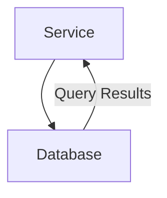
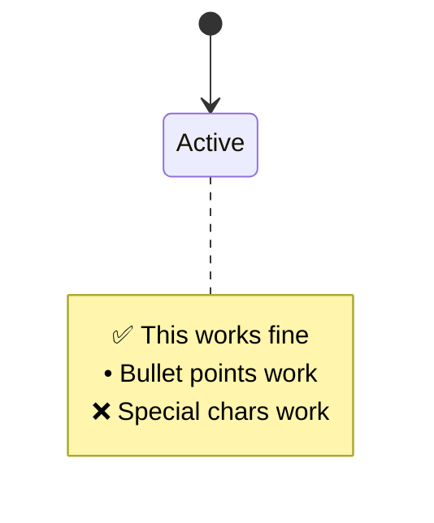

# Mermaid Syntax Rules

## **What Works (from working diagrams in diagram.md):**

- Special characters in notes: ❌ ✅ • work fine
- Complex node labels: "Claims Extraction Service", "PostgreSQL with RLS Policies"  
- Connection labels: "Get Session with Claims", "SET LOCAL app.tenant_id from claims"
- Multi-line state content with colons and descriptions
- RGB color styling: rect rgb(240, 250, 240)
- Participant aliases: participant Router as API Router

## **Working Examples:**

**Simple Graph:**

**State with Notes:**

## **What Breaks Diagrams:**

From conversation history failures:
- Missing diagram type declaration (just having node syntax without graph TB/flowchart/etc)
- Malformed syntax within diagram blocks
- Not actual content - syntax structure issues
- br tags

## **Key Rule:**

Start with proper diagram type. Content is very permissive when structure is correct.